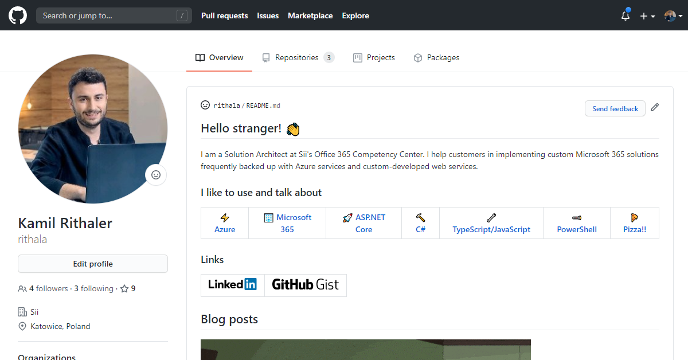

[🏠 Home Page](https://github.com/rithala) | [🍕 Pizza & life](../)
-|-

# Create Your GitHub Profile README

👨 Kamil Rithaler | 📅 2020-07-29
-|-



---

One of the newest features of GitHub is the possibility to create a profile README page.
You can reuse your current markdown skill set to turn a GitHub profile page into robust curriculum vitae or even blog!

## All you need to do is

1. Create a new repository with an exact name as your account (e.g. my account name is ```rithala``` so I had to create ```rithala``` repository). If you already have one, then you have to rename that repository first and after that you can create "profile" repository.
2.  Create ```README.md``` file in the root directory
3.  Fill that file with markdown awesomeness 🤘
4.  Commit and push (```README.md``` file should be in the ```master``` branch to be visible on the GitHub profile page)!

## Thank you for reading my the very first blog post

I was thinking about starting own blog for a long time but I never had enough motivation to do that. When I have read about new GitHub profile pages, I thought that may be a good excuse to experiment with the GitHub profile page as a blog platform.

This is just a proof of concept, that is why all the content is created manually. I am going to automate updating the profile and categories pages with [GitHub Actions](https://github.com/features/actions) and for sure I will update you here about the progress.

### Useful links

* [🏠 My GitHub profile page](https://github.com/rithala)
* [A curated list of awesome Github Profile READMEs](https://github.com/abhisheknaiidu/awesome-github-profile-readme)
* [Markdown Cheatsheet](https://github.com/adam-p/markdown-here/wiki/Markdown-Cheatsheet)
* [GitHub Emojis](https://gist.github.com/rxaviers/7360908)

## [✉️ Comments section](https://github.com/rithala/rithala/issues/1)


