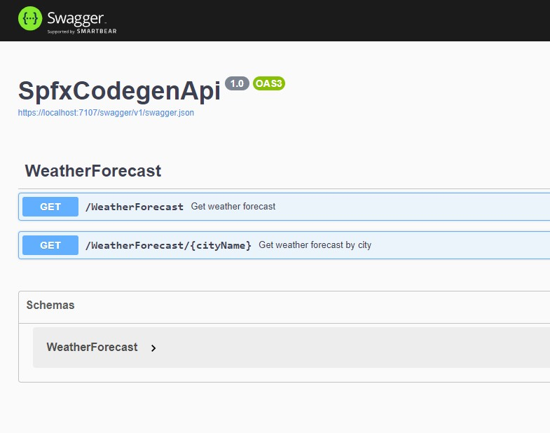
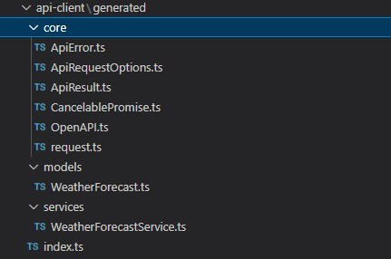

This is another post about generating an API client. Creating API clients is one of those tasks that should be automated as much as possible. In most cases, you just write the same code over and over by replicating the API schema. Previously, I was talking about [generating Power Platform custom connectors](../automate-deployments-of-custom-power-platform-connectors) based on an Open API definition. This time let's talk about doing it in TypeScript and using it in an SPFx project.

## OpenAPI Typescript Codegen NPM package

You can find many packages that can generate API clients in TypeScript. I especially like this one. It is quite flexible, supports many HTTP client libraries, and you can easily add your authentication to it. Last but not least, it takes as much information from an Open API as it can. This tool even adds JSDoc comments to the client methods!

How to use it? First, you must install [the tool](https://www.npmjs.com/package/openapi-typescript-codegen) in your project.

```bash
npm install openapi-typescript-codegen --save-dev
```

## Generating the client

Now it is time to generate the client. We will take a slightly modified base ASP.NET Web API project with the weather forecast controller.



Ensure there are operation ids as they will be your client's methods names. Otherwise, the generator concatenates the HTTP method name and path. This might result in some ugly names. Also, it is nice to have methods and parameter descriptions in place. It will be used to document the client's methods.

Save the API definition to a JSON file and run the generator command.

```bash
npx openapi-typescript-codegen --input ./apiDef.json -o ./src/api-client/generated
```

The generator populates the output directory with its core models, API models, and services for path groups (tags).



The file that is most important for us is `WeatherForecastService.ts`. Let's have a look at what you can find inside.

```TypeScript
// WeatherForecastService.ts
// Imports omitted for brevity
export class WeatherForecastService {

    /**
     * Get weather forecast
     * @returns WeatherForecast Success
     * @throws ApiError
     */
    public static getWeatherForecast(): CancelablePromise<Array<WeatherForecast>> {
        return __request(OpenAPI, {
            method: 'GET',
            url: '/WeatherForecast',
        });
    }

    /**
     * Get weather forecast by city
     * @param cityName City name
     * @returns WeatherForecast Success
     * @throws ApiError
     */
    public static getWeatherForecastByCity(
cityName: string,
): CancelablePromise<Array<WeatherForecast>> {
        return __request(OpenAPI, {
            method: 'GET',
            url: '/WeatherForecast/{cityName}',
            path: {
                'cityName': cityName,
            },
        });
    }

}
```

It is super clean and simple. Now just set the base URL for the API and use one of the methods to get the data.

```TypeScript
import { OpenAPI, WeatherForecastService } from './generated';

OpenAPI.BASE = 'https://your-api.com/api';
const forecast = await WeatherForecastService.getWeatherForecast();
```

Alright, you should end up with a fully functional client.

You can simplify generating the API client by creating an NPM script to save some time during the next runs.

```json
// package.json

"scripts" : {
  "generate-client": "openapi-typescript-codegen --input ./temp/apiDef.json -o ./src/api-client/generated",
  "pregenerate-client": "curl https://your-api.com/swagger.json -L --output ./temp/apiDef.json"
  // ...
}
```

Then when you run `npm run generate-client` the script downloads the latest API schema and then generates the client.

## Authentication

Probably you have already wondered how to modify the request before sending it to add the JWT token to the headers. It is pretty simple. The client has the `OpenAPI` configuration object. One of its properties is `TOKEN`. Which can be a string or a function that returns the promise with the token.

```TypeScript
import { OpenAPI } from './generated';
import { OAuth } from './oauth-client';

OpenAPI.BASE = 'https://your-api.com/api';
OpenAPI.TOKEN = async (options) => await OAuth.getToken();
```

## Use the client inside an SPFx project

You got the API client ready and you know how to add an authentication token. The next step is to wire all things together with the SPFx context.

You told the generator to put the client into `src/api-client/generated`. This allows you to separate your code from the generated one and keep simple imports. Additionally, the next client updates will not break your client configuration. Add a new file under `src/api-client/index.ts` with the following content.

```TypeScript

import { OpenAPI } from './generated';
import { BaseComponentContext } from '@microsoft/sp-component-base';

export * from './generated';

export async function setupApiClient(
    spfxContext: BaseComponentContext,
    apiUrl: string,
    resourceEndpoint: string) {

    // Get AAD token provider
    const tokenProvider = await spfxContext.aadTokenProviderFactory.getTokenProvider();

    // Set base API url
    OpenAPI.BASE = apiUrl;

    // Get token for provided resource endpoint (e.g. api://934ac834-9390-49ce-9fa5-ffdbca6ba3f1).
    // The second parameter indicates that the token should be cached
    OpenAPI.TOKEN = async (options) => await tokenProvider.getToken(resourceEndpoint, true);
}

```

Execute the created function inside the SPFx component `onInit()` method.

```TypeScript
// HelloWorldWebPart.ts
export default class HelloWorldWebPart extends BaseClientSideWebPart<IHelloWorldWebPartProps> {
  // ...
  protected async onInit(): Promise<void> {
      await super.onInit();
      await setupApiClient(this.context, this.properties.apiUrl, this.properties.resourceEndpoint);
  }
}
```

Since then you can import one of the services and use it inside your SPFx customization.

```TypeScript
import { WeatherForecastService } from '../api-client';

const forecast = await WeatherForecastService.getWeatherForecast();
```

## Summary

Just one package and a few lines of code may greatly improve your experience in working with custom APIs inside an SPFx (not only) project.

Happy coding!