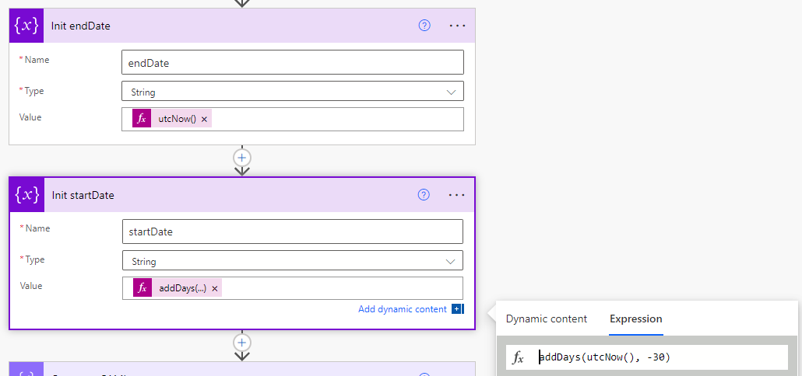

> Let's assume you need to summarize the sales data per salesman and prepare a monthly report that will be sent to the manager.


How can you do this in Power Automate? The first thing that may come to your mind is to use SharePoint's **"Get Items"** action to get all list items for the desired time frame and then calculate the sums yourself in the **"Apply to each"** loop. It may work for a small list but it will fail when we get to a larger number of items. Firstly, because of the action maximum items threshold (5000). Secondly, it will take ages to calculate that.

In this article, I present the solution that offloads the calculations to the SharePoint API using the **"renderListDataAsStream"** method. Instead of calculating the aggregations in a flow, the SharePoint API returns already aggregated data.


## Render List Data As Stream REST Method

First of all, let's get to know the tools which we will be using. "RednderListDataAsStream" is the SharePoint REST API method that allows retrieving list items using a CAML query. This approach is the most flexible way to query SharePoint lists data and is widely used by SharePoint's team to build the SharePoint UI. You can learn more about it in [a great article](https://sii.pl/blog/working-with-large-sharepoint-lists/) written by my colleague Ewelina. The endpoint is available under the following URL.

```
[POST] _api/web/lists/getByTitle('<list name>')/RenderListDataAsStream
```

## CAML Aggregations

If you are familiar with SQL aggregations then CAML aggregations should be pretty straightforward for you. In general, aggregations allow summarizing data as a metric. In CAML you can use one of the following aggregations:

| Aggreagation | Description |
|---|---|
| COUNT | Count list items |
| AVG | Average |
| MAX | Maximum |
| MIN | Minimum |
| SUM | Sum |
| STDEV | Standard deviation |
| VAR | Variance |

How do you use it in a CAML query? Here is an example of a CAML query summarizing data in the "OrderValue" field.

```xml
<View>
    <Aggregations Value="On">
        <FieldRef Name="OrderValue" Type="SUM" />
    </Aggregations>
    <ViewFields>
        <FieldRef Name="OrderValue" />
    </ViewFields>
    <RowLimit>1</RowLimit>
</View>
```

The query above returns the sum of the order value in all list items (some fields are omitted for brevity).

```json
{
  "Row": [
    {
      "OrderValue.SUM": "16,239,943.51 zł"
    }
  ]
}
```
Often, you may want to receive the sum for a group. In our case let's assume we want a sum of the order value (OrderValue) column per product category (ProductCategory).

When you are grouping the items it is important to remember how will it behave in a paged response which is the default behavior of this endpoint. You always have to match the "GroupLimit" attribute of the GroupBy element with the value of the row limit element.

```xml
<View>
    <Aggregations Value="On">
        <FieldRef Name="OrderValue" Type="SUM" />
    </Aggregations>
    <Query>
        <GroupBy Collapse="TRUE" GroupLimit="20">
            <FieldRef Name="ProductCategory" />
        </GroupBy>
    </Query>
    <ViewFields>
        <FieldRef Name="ProductCategory" />
        <FieldRef Name="OrderValue" />
    </ViewFields>
    <RowLimit Paged="TRUE">20</RowLimit>
</View>
```
Then the response looks like this. The aggregated value is returned in ***FieldName.AggreagtionFunction.agg***.

```json
{
  "Row": [
    {
      "ProductCategory": [
        {
          "lookupId": 1,
          "lookupValue": "Beverages"
        }
      ],

      "ProductCategory.singleurlencoded": "Beverages",
      "OrderValue.SUM.agg": "2,123,446.16 zł"
    },
    {
      "ProductCategory": [
        {
          "lookupId": 2,
          "lookupValue": "Condiments"
        }
      ],
      "ProductCategory.singleurlencoded": "Condiments",
      "OrderValue.SUM.agg": "1,813,982.89 zł"
    },
    {
      "ProductCategory": [
        {
          "lookupId": 3,
          "lookupValue": "Confections"
        }
      ],
      "ProductCategory.singleurlencoded": "Confections",
      "OrderValue.SUM.agg": "2,092,854.43 zł"
    }
  ]
}
```

## How to use it in a Power Automate flow?

Now that you know the theory it is time to use it. What was the assumption that the article starts with?

> Let's assume you need to summarize the sales data per salesman and prepare a monthly report that will be sent to the manager.

So we start with a blank flow with a schedule trigger that runs every month.


Next, create variables for a time frame.



Now is the crucial part, you got to prepare the CAML query. The most convenient way is to use the ***Compose*** action. Make your job easier by using single quotes for attribute values. Then you do not need to escape it when sending it in a JSON body.


It is time to send the request to the API. Use the "Send an HTTP request to SharePoint REST" action, set the method parameter to POST and use the described render list data as a stream method for a selected list.

You can add the ***Accept*** header with ```application/json;odata.metadata=none``` value to omit the ODATA metadata in the response.

Also, when you use "renderListDataAsStream" is nice to add the ```DatesInUtc``` parameter. Then you are sure that the service account time zone setting does not affect your result.


The last task on our list is to send the collected data as a mail report.

I recommend testing the flow at this stage and copying the JSON response. Then add the ***Parse JSON*** action, and use the copied JSON to generate a JSON schema. This will help in working with the action's response in the editor.

To make the flow even faster use ***Select*** and ***Create HTML table*** operations instead of ***Apply to each*** to build the report content.


Now just send the report as an email.


That's it! What does the report look like? For sure we can play around with the HTML to make it look better, but should be enough for MVP 🙂


